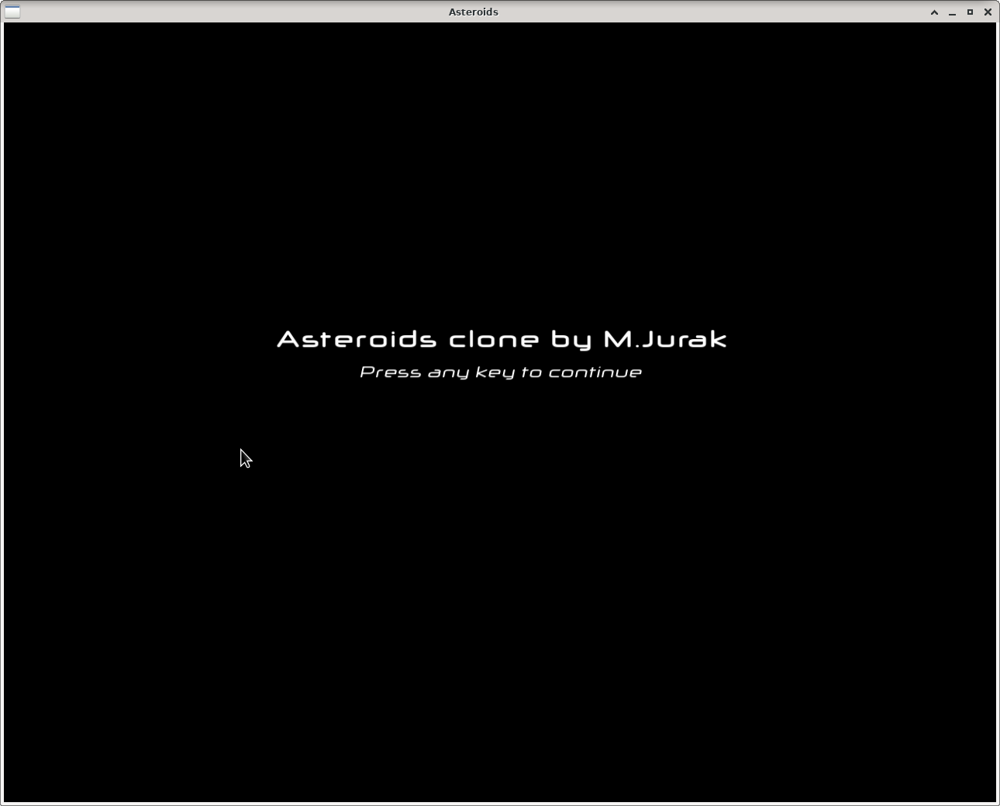
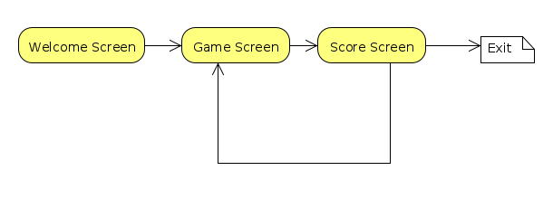

# Asteroids sa _stanjima_
## Moju (ne profesorovu) finalnu verziju možete vidjeti na sljedećem linku: https://drive.google.com/drive/folders/1k11n0lCXBiBrUNWgUu0dNxlt_DsQkq4K?usp=sharing
U ovom je zadatku potrebno doraditi _Asteroids_ igru dodavanjem
pozdravnog ekrana i ekrana za prikaz rezultata i nastavak igre.

Igra započinje pozdravnim ekranom. Na primjer:



(Vi ćete staviti svoje ime na ekran.)
Nakon što se pritisne bilo koja tipka počinje igra.
Igrač dobiva ekran igre:


Kada igra završi ispisuje se rezultat (broj bodova) i način nastavka i završetka 
igre.


## Konačni automat

Vidmo da naša aplikacija ima niz stanja u kojima se ponaša na različite
načine. U igri mora reagirati na strelice i razmaknicu, u ostalim stanjima reagira
 na  `Return` i `Escape` ili na bilo koju tipku. Svako stanje radi drukčije
 iscrtavanje. Iz jednog stanja se može prijeći u  drugo stanje
 prema _pravilima igre_. Takva se struktura naziva _konačni automat_
 i u našem slučaju je vrlo jednostavna i može se prikazati na ovaj način:

 


Različita stanja bismo mogli implementirati tako da u tri metode
`Game` klase:  `processEvents()`, `update()` i `render()`  imamo
jednu `if` naredbu unutar koje tretiramo svako pojedino stanje.
Takvo se rješenje ne skalira dobro jer vodi na implementaciju
logike različitih stanja na jednom mjestu.

**State** oblikovni obrazac na omogućava da kod koji pripada različitim
stanjima odvojimo u zasebne klase.

**Napomena**: Monolitnu metodu `processEvents()` treba faktorizirati
tako da se dio logike vezane uz svako od tri posebna stanja prebaci u metodu
`handleEvents()` unutar klase koja predstavlja stanje.

## _State_ oblikovni obrazac

Umjesto da implementiramo logiku različitih stanja u jednoj velikoj if
naredbi stavit ćemo logiku svakog pojedinog stanja u zasebnu klasu. Time dobivamo
sljedeću strukturu:

 

 Ovdje je uvedena apstraktna bazna klasa `State` koja nudi sučelje koje apstrahira
  pojedina stanja. Konkretna stanja su implementirana u zasebnim klasama
 `ConcreteStateA`, `ConcreteStateB` itd. Klasa `Context` sadrži kod koji se mijenja
 prilikom promjene stanja. Ona drži referencu na `State` objekt koja je u svakom trenutku
 inicijalizirana konkretnim stanjem. Dio koda unutar metode `request()` koji ovisi
 o stanju delegira se konkretnom stanju kroz referencu na  `State`. Promjenu stanja
 (prelazak iz jednog stanja u drugo) mogu vršiti sama stanja ili `Context` promjenom `state` pokazivača.

U našem slučaju  `Context` će biti `Game` klasa. Njene metode `processEvents()`
`update()` i `render()` ovise o stanju. Kako metoda `processEvents()` obrađuje i događaje koji ne ovise
o trenutnom stanju to faktoriziramo dio te metode u
`handleEvents()` metodu koju sadrži svako stanje. Stoga u `State` klasu (koju ćemo nazvati `GameState`)
izdvajamo tri metode: `update()`,  `handleEvents()` i `render()`. Dodali smo još i metodu `init()`
jer pojedina stanja (_Play_ i _Score_) traže određenu inicijalizaciju kod svakog ponovnog ulaženja u stanje.

 Metoda `run()`  može pozivati metode specifične za pojedino stanje kroz pokazivač na
trenutno stanje (`mpGameState`). Time dolazimo do sljedeće implementacije oblikovnog obrasca:


Sve metode u `GameState` su čiste virtualne funkcije prerađene u izvedenim klasama (ne zaboravite `override`).


## Mijenjanje stanja

Ostaje još pitanje tko će mijenjati trenutno stanje u klasi `Game`. U ovom slučaju
to mogu raditi sama _stanja_. Klasa `Game` treba ponuditi metodu

```c++
void setState(GameState::State newState)
```
a sve state-klase trebaju uzeti u svom konstruktoru pokazivač na  `Game`
objekt kako bi mogle postaviti sljedeće stanje igre.
Taj je pokazivač prirodno čuvati u baznoj klasi
`GameState`. Sva stanja trebaju biti alocirana u konstruktoru `Game`
klase i dealocirana u destruktoru. To znači da `Game` klasa treba čuvati vektor pokazivača na sva stanja, 
na primjer
```c++
std::array<GameState*, 3> mAllStates;
```
Za indeksiranje pojedinih stanja koristiti enumeraciju koja se može smjestiti u klasu  `GameState`. Time 
izbjegavamo obične indekse koji čine kod teško čitljivim.

Unutar `Game` treba ponuditi i metodu 
```c++
sf::RenderWindow * getWindow();
```
koja će vratiti pokazivač na otvoreni prozor, jer stanja trebaju prozor za iscrtavanje. 

**Napomena**. Kad god imamo _goli pokazivač_ onda treba pretpostaviti da on **nije** vlasnik resursa 
na koji pokazuje. Vlasništvo osiguravamo upotrebom pametnih pokazivača.  

## Dijeljenje podataka između stanja

Ovaj je obrazac najjednostavniji kada stanja ne moraju
dijeliti podatke. U našem slučaju stanja `PlayState` i `ScoreState` trebaju dijeliti igračev rezultat.


Budući da sva stanja drže referencu (pokazivač) na klasu `Game`, a klasa `Game` sadrži pokazivače na 
sva stanja imamo vezu između svaka dva stanja. Stanja se mogu učiniti prijateljima klase  `Game` da se 
izbjegnu dodatne get-metode. 

## Restartanje igre

Nakon svakog povratka iz `ScoreState` u `PlayState` stanje igru treba restartati  za što nam treba metoda `init()`. 


## Upute

Trebate poći od vašeg prethodnog koda i većinu koda koji se sada nalazi u `Game` klasi 
(ako niste stvarali posebnu _world_ klasu)   smjestiti u `PlayState` klasu. 
Imat ćemo 4 dodatne datoteke koje su vam dane u repozitoriju. To su `gamestate.h` i  `gamestate.cpp`
te  `playstate.h` i  `playstate.cpp`. `Playstate` je izdvojen jer je većina koda u toj klasi. 
Ostale datoteke trebate prekopirati iz prethodnog zadatka. 
Ukoliko vaš sustav datoteka nije identičan ovome ne zaboravite promijeniti i sustav izgradnje. 

